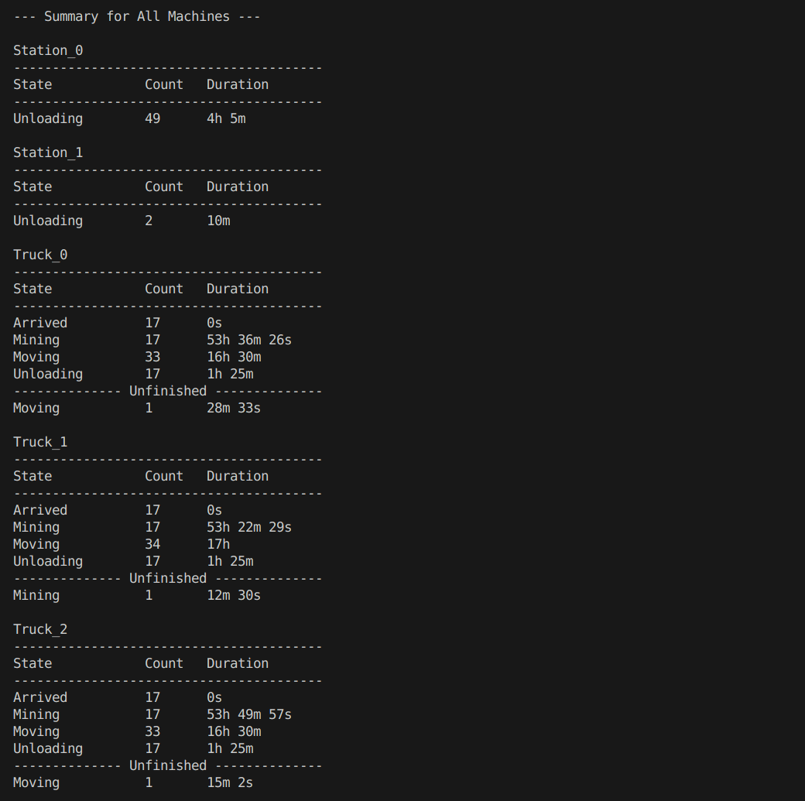
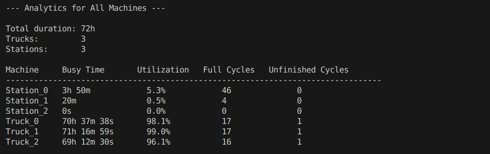

# Helium-3 Mining

## General Approach

This simulation framework follows an **event-driven architecture**: each truck and station produces `Event` objects that describe a change of state (e.g., mining, moving, arriving, unloading). A central event loop in the `Simulation` consumes these events in chronological order, advancing the simulation clock and enqueuing subsequent actions. All events — along with their timestamps and durations — are recorded by a centralized logging interface (`ILog`), enabling:

- **Deterministic testing** via predictable factories.
- **Statistical analysis** for random-duration scenarios.
- **Extensibility** through pluggable components and analytics.

## Interfaces

- `Event`: A simple struct that captures a machine’s state transition, including the machine ID, the name of the state, the start time, and the duration.
- `IMachine`: Abstract base for any active entity (trucks or stations) that can generate events.
- `ITruck`: Interface for mining trucks that produce mining and moving events.
- `IStation`: Interface for unloading stations that accept trucks and generate unloading events.
- `ITrucksManager`: Manages the lifecycle of all trucks, dispatching their initial mining events and looking up by ID.
- `IStationManager`: Oversees all unloading stations, selecting the optimal station and routing trucks to it.
- `ISimulation`: Defines the simulation lifecycle (`initialize`, `run`) and provides access to the event log.
- `ILog`: Records every event (complete or unfinished), exposes the raw event list, and summarizes per-machine statistics.

## Documentation

[API Documentation](https://voxff.github.io/helium-3/)

To generate documentation in local `/docs` folder, run:

```bash
doxygen Doxyfile
```


## Project Structure

```plaintext
/helium-3
├── simulation/        # core engine
│   ├── common/         # shared types (Event, Time, State)
│   ├── interfaces/     # public API classes (ISimulation, ILog, etc.)
│   └── implementation/  # concrete classes (Simulation, Log, TrucksManager...)
├── testing/            # unit tests (PredictedTest, SimpleTest, etc.)
├── main.cpp            # test runner entry point
├── .gitignore          # build excludes
└── README.md           # project documentation
```

## Testing and Analytics

- **SimpleTest**: Runs the simulation with random mining durations to generate a rich sequence of events. Prints a full summary and analytics for each machine, but does not verify specific numeric results.

- **PredictedTest**: Runs the simulation with fixed, predictable mining durations to produce deterministic outputs. Verifies the summary and analytics against expected values for each machine.

Exmaple ouput:

<p align="center">
  
</p>

<p align="center">
  
</p>

## Considerations

- **Centralized Logging vs. Distributed**: Single `ILog` instance to record all events for easier aggregation and testing. Machine-level logging have benefits but would complicate access and grow grow resposibilies of `IMachine`.

- **Station Selection**: Deciding whether to handle `ArrivedToStation` state transitions within the main event loop (`Simulation`) vs. inside `UnloadingTruck`/`Station` impacts separation of concerns. We opted to enqueue next events centrally for full visibility.

- **Analytics Location**: Gathering metrics (utilization, cycle counts) can be done within `ILog` implementations or deferred to test fixtures (e.g., `SimulationTest::printAnalytics`). Placing analytics in tests keeps the core engine free of reporting logic.

---

*Helum-3*
